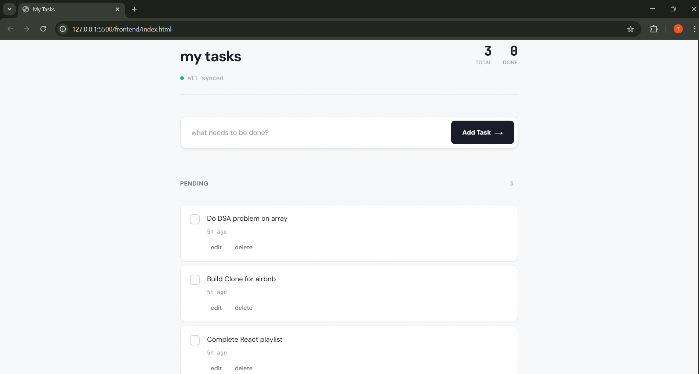

# Task Manager

A simple task app I made for keeping track of assignments and stuff. Works pretty well for daily use.



## What it does

- Add tasks (press Enter or click the button)
- Edit them if you mess up
- Check off when done
- Delete what you don't need
- Shows pending and completed separately
- Keeps count of everything

Everything saves to a database so your tasks don't disappear when you close the tab.

## How I built it

Used Node.js for the backend with Express handling the API calls. Frontend is just plain HTML/CSS/JavaScript - didn't use React or anything, wanted to get better at vanilla JS first.

Database is SQLite because it's easy to set up and I don't need anything more complex for this.

**Tech:**
- Frontend: HTML, CSS, JavaScript
- Backend: Node.js + Express
- Database: SQLite

## Running it locally

First install the backend stuff:
```bash
cd backend
npm install
npm start
```

Then open `frontend/index.html` in your browser. Or if you want to use a proper server:
```bash
cd frontend
python3 -m http.server 8000
```

Backend runs on port 3000, frontend on 8000 (or just open the file directly).

## How it's organized

```
├── backend/
│   ├── server.js          - API routes
│   ├── database.js        - SQLite setup
│   └── package.json
├── frontend/
│   ├── index.html
│   ├── style.css
│   └── app.js
└── screenshots/
    └── homepage.png
```

## The API

Pretty straightforward REST setup:

- `GET /api/tasks` - gets all tasks
- `POST /api/tasks` - adds a new one
- `PUT /api/tasks/:id` - updates task text
- `PUT /api/tasks/:id/toggle` - marks done/undone
- `DELETE /api/tasks/:id` - removes it

## Things I figured out while building this

- How to properly structure a REST API
- Working with SQLite and SQL queries
- Handling async operations with fetch
- Managing state in vanilla JavaScript
- Making the UI update without page refreshes

## Stuff I'd add if I had more time

- Login system so multiple people can use it
- Categories or tags for tasks
- Due dates
- Dark mode (would look pretty cool)
- Better error messages when things go wrong

## Notes

The database file (tasks.db) gets created automatically when you run the backend, so don't worry if you don't see it at first.

Also yeah the mobile version could be better, might fix that later.

---

Made this to learn full-stack development properly. Feel free to use it or modify it however you want.